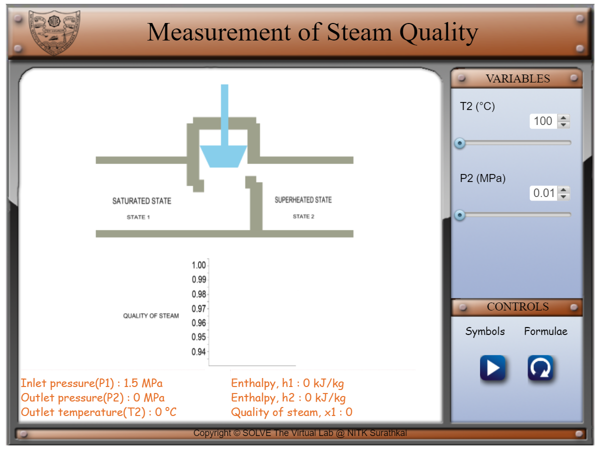
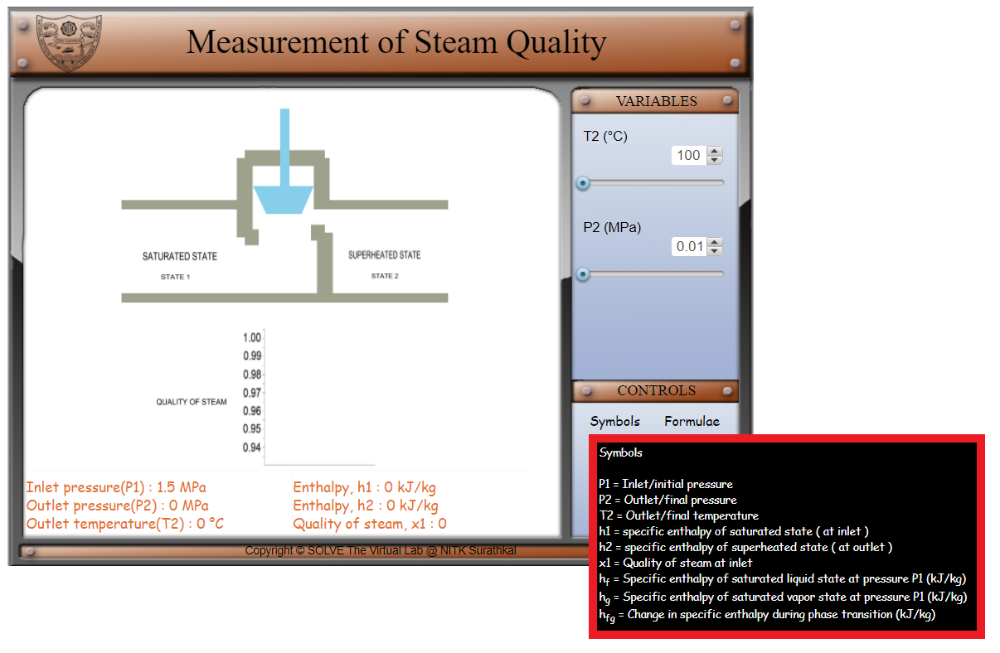
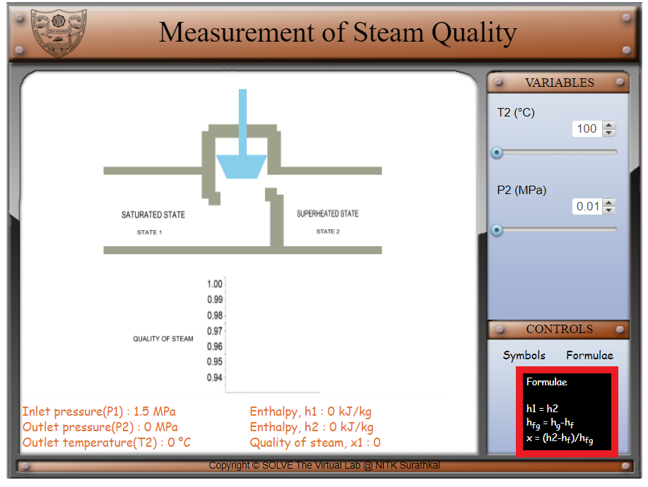
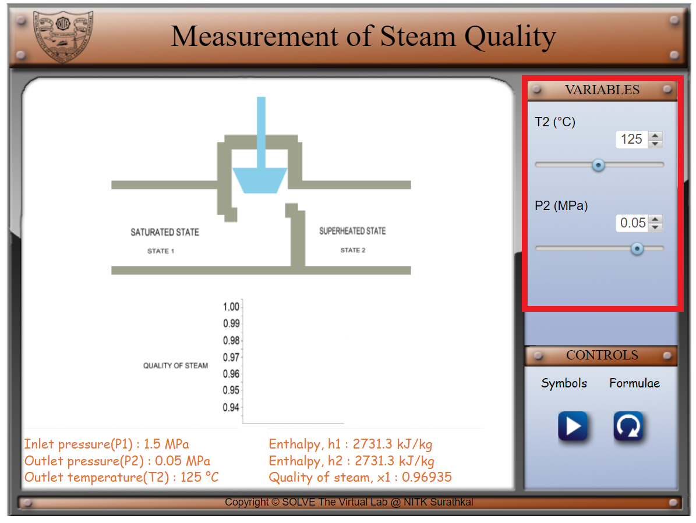
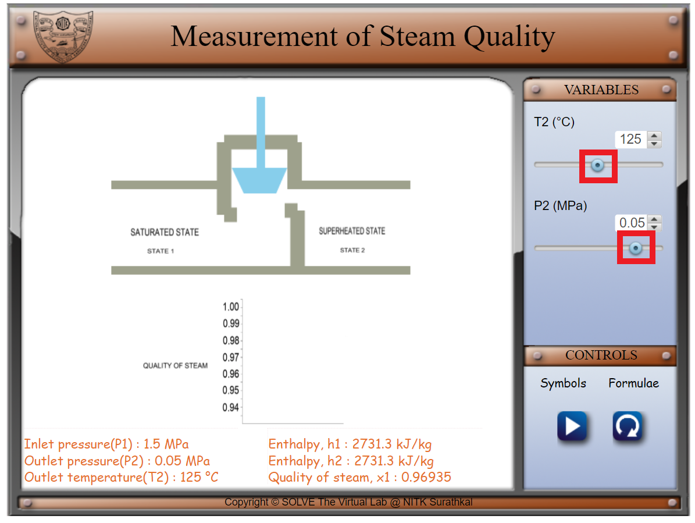
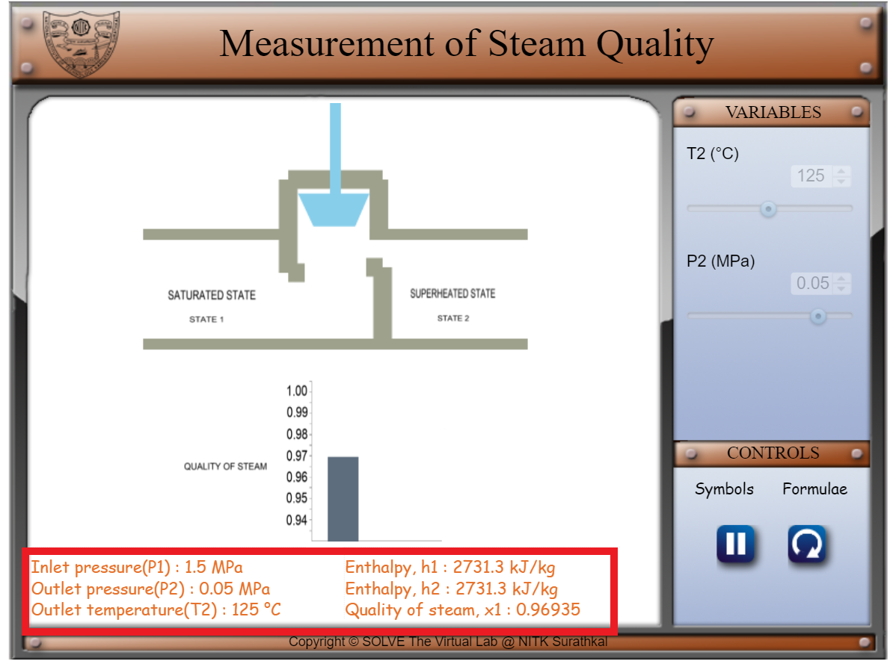
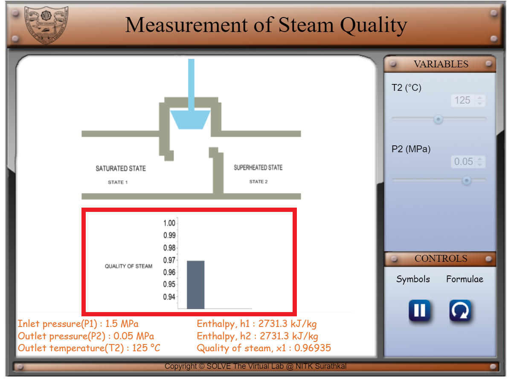

#### These procedure steps will be followed on the simulator

1. In the simulation window, front view of the throttling valve setup is visible.
 
2. The various symbols and the formulae involved in the experiment are displayed in the control panel when the cursor hovers over ‘Symbols’ and ‘Formulae’ respectively.
 
 

3. The parameters of the system can be varied by changing the variables as shown below.

 

4. Move the knob of the slider to change the value of Outlet temperature which varies among three values: 100°C, 125°C and 150 °C. The value of Outlet pressure can vary among six values: 0.01 MPa, 0.02 MPa, 0.03 MPa, 0.04 MPa, 0.05 MPa and 0.06 MPa.
 

 

5. Parameters including Inlet pressure, Outlet pressure, Outlet Temperature, Enthalpy at inlet and outlet and Quality of steam are displayed at the bottom.
 

 

6. Visualise the effect of the change of the parameters on the quality of steam with the help of a graph. 

 
