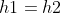
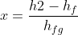

## INTRODUCTION 

#### User Objectives and Goals:

1. Define the procedure for the measurement of steam quality.
2. Interpret the setup i.e., the throttling valve arrangement.
3. Calculate specific enthalpy and quality of steam.
4. Examine the effect of change in parameters like Outlet pressure and Outlet temperature on the parameters like enthalpy.
5. Analyse how change in parameters like Outlet pressure and Outlet temperature can affect the quality of steam using a bar graph.

#### Theory

When a substance is in the compressed liquid region or the superheated vapour region, pressure and temperature are independent properties. They are measured to determine the state of the substance. But when a substance is in the saturated or two-phase region, out of pressure and temperature, only one quantity is independent, the other is a dependent property.
In this case, to determine the state of the mixture, apart from either temperature or pressure, one more property, such as specific volume, enthalpy or quality of the mixture must be known. Because it is comparatively harder to measure the specific volume of a mixture, calorimeters are utilized to obtain the quality or the enthalpy of the mixture.

The goal, in the measurement of quality, is to change the state of the substance from the two-phase region to the single-phase or superheated region. Here, both temperature and pressure are independent properties and can be measured to determine the state of the substance. This goal is achieved by adiabatic throttling.

Throttling is a process in which the conversion of high-pressure fluid into a low-pressure fluid takes place. This process is carried out using a throttle valve. The enthalpy remains constant in a throttling process.

In the throttling calorimeter, a sample of wet steam of pressure P1 is obtained from a steam main by means of a perforated sampling tube. It is then throttled by the partially open valve to a pressure P2 and temperature T2. This is done so that after throttling, the steam is in the superheated region. According to the steady flow energy equation, the enthalpy after throttling is equal to the enthalpy before throttling. The initial state (wet) is given by P1 and x1, while the final state (superheated) is given by P2 and T2.

#### Abbreviations:

1. P1 = Inlet/initial pressure
2. P2 = Outlet/final pressure
3. T2 = Outlet/final temperature
4. h1 = specific enthalpy of saturated state ( at inlet )
5. h2 = specific enthalpy of superheated state ( at outlet )
6. x1 = Quality of steam at inlet
7. hf = specific enthalpy of saturated liquid state at pressure P1
8. hg = specific enthalpy of saturated vapor state at pressure P1
9. hfg = change in specific enthalpy during phase transition

#### Equations/formulae:

 

 

 
