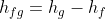
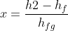
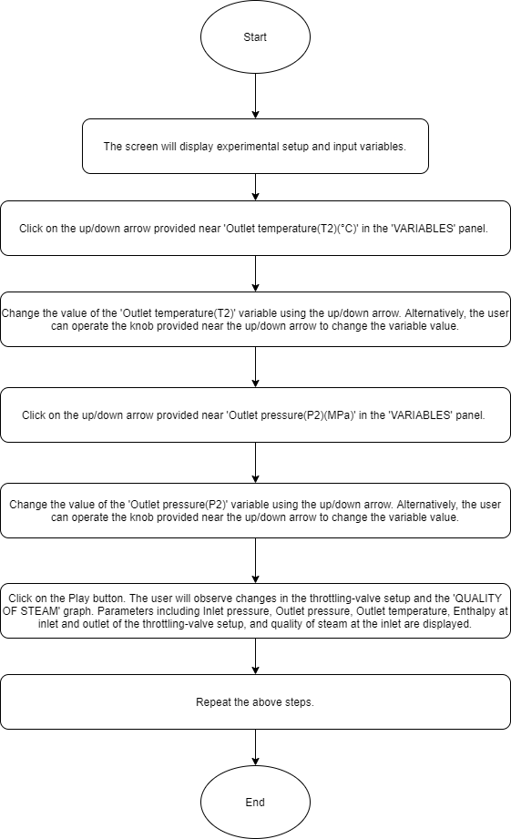
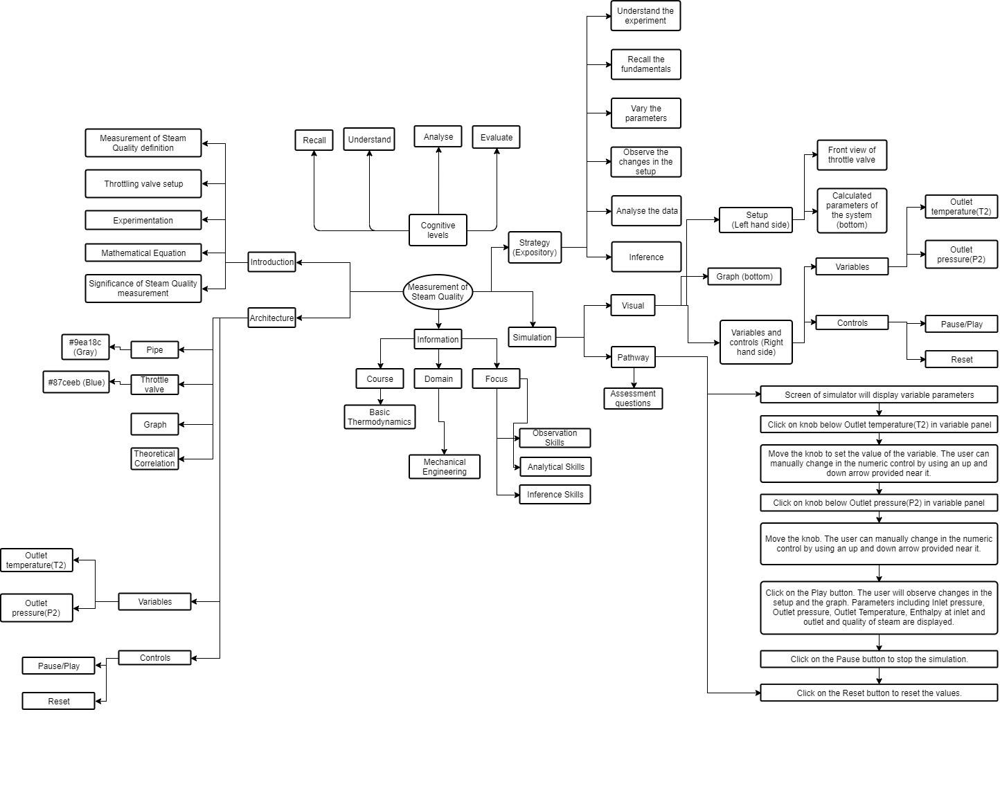
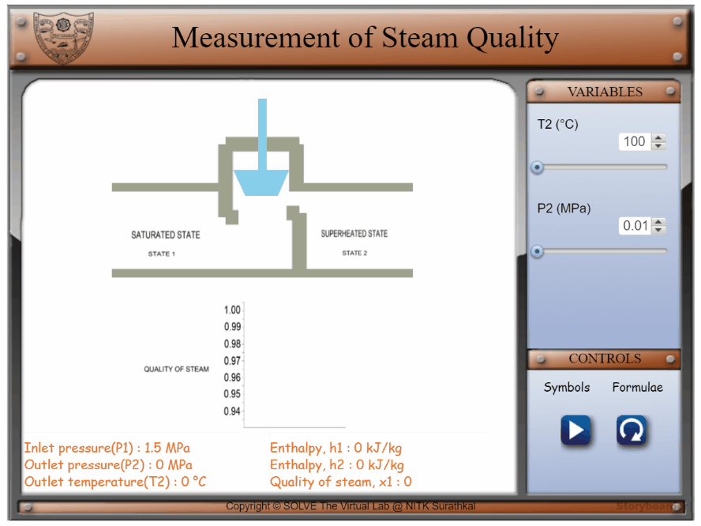

## Storyboard (Round 2)

Experiment: Measurement Of Steam Quality

**1. Story Outline**:

When a substance is in the compressed liquid region or the superheated vapour region, pressure and temperature are independent properties. They are measured to determine the state of the substance. But when a substance is in the saturated or two-phase region, out of pressure and temperature, only one quantity is independent, the other is a dependent property.
In this case, to determine the state of the mixture, apart from either temperature or pressure, one more property, such as specific volume, enthalpy or quality of the mixture must be known. Because it is comparatively harder to measure the specific volume of a mixture, calorimeters are utilized to obtain the quality or the enthalpy of the mixture.

The goal, in the measurement of quality, is to change the state of the substance from the two-phase region to the single-phase or superheated region. Here, both temperature and pressure are independent properties and can be measured to determine the state of the substance. This goal is achieved by adiabatic throttling.

Throttling is a process in which the conversion of high-pressure fluid into a low-pressure fluid takes place. This process is carried out using a throttle valve. The enthalpy remains constant in a throttling process.

In the throttling calorimeter, a sample of wet steam of pressure P1 is obtained from a steam main by means of a perforated sampling tube. It is then throttled by the partially open valve to a pressure P2 and temperature T2. This is done so that after throttling, the steam is in the superheated region. According to the steady flow energy equation, the enthalpy after throttling is equal to the enthalpy before throttling. The initial state (wet) is given by P1 and x1, while the final state (superheated) is given by P2 and T2.

In this experiment, the quality of steam is measured using a throttling-valve setup. Given the initial pressure P1, the final temperature T2 and the final pressure P2 of steam, the quality ‘x1’ of steam is determined. Here, the variables that can be changed by the user are T2 and P2 (from a given set of pre-set values), while P1 remains constant as the pressure of the saturated fluid. By changing the two variables using a slider, the user can see the corresponding change in the quality and enthalpy of steam and visualize it using a bar graph.

 **2. Story**:

  **2.1 Set the visual stage description**:

  The experiment consists of a pipe fitted with a throttle valve arrangement. All the buttons and the parameters control are on the right side of the frame. The variable panel contains sliders for Outlet temperature and Outlet pressure.
  The throttling-valve setup is two horizontal lines which make up the pipe and a rectangle and a trapezium which make up the throttle valve.
  By changing the parameters, for example, Outlet temperature, the final temperature of the throttling-valve setup changes. By changing Outlet pressure, the final pressure of the throttling-valve setup changes.

  **2.2 Set User Objectives & Goals**:
* Define the procedure for the measurement of steam quality.
* Interpret the setup i.e., the throttling valve arrangement.
* Calculate specific enthalpy and quality of steam.
* Examine the effect of change in parameters like Outlet pressure and Outlet temperature on the parameters like enthalpy.
* Analyse how change in parameters like Outlet pressure and Outlet temperature can affect the quality of steam using a bar graph.
* Define the procedure for the measurement of steam quality.
* Interpret the setup i.e., the throttling valve arrangement.
* Calculate specific enthalpy and quality of steam.
* Examine the effect of change in parameters like Outlet pressure and Outlet temperature on the parameters like enthalpy.
* Analyse how change in parameters like Outlet pressure and Outlet temperature can affect the quality of steam using a bar graph.

  **2.3 Set the pathway activities**:

  1. The initial Outlet temperature value is taken as 100°C.
  2. The initial Outlet pressure value is taken as 0.01 MPa.
  3. The Outlet temperature parameter can be varied among three values 100°C, 125°C and 150 °C.
  4. The value of Outlet pressure can vary among six values, 0.01 MPa, 0.02 MPa, 0.03 MPa, 0.04 MPa, 0.05 MPa and 0.06 MPa.
  5. Change the parameters of the system to understand the changes in the throttling-valve setup and steam quality graph.

  **2.4 Set Challenges and Questions/Complexity/variation**

  **2.4.a Questions before simulation**:

  <u>Pre-test Questions </u>

  1. “The quality of saturated vapour is 100%”. Indicate whether this statement is
      <ol type="a">
      <li>True</li>
      <li> False</li> 
              </ol> 
             Answer: a
       
  2. Given that hfg = 1716.2 kJ/kg, hf = 1085.36 kJ/kg, find the value of hg.
      <ol type="a">
    <li>630.84 kJ/kg</li>
    <li> 2800.43 kJ/kg</li>
    c) 2801.56 kJ/kg</li>
      d) 629.21 kJ/kg</li>
       </ol>
      Answer: c

  3. For a substance in the single-phase region,
  <ol type="a">
  <li>both pressure and temperature are independent properties</li>
  <li>if pressure is given, the temperature gets fixed</li>
  <li>none of the above</li>
  <li>both a and b</li>
   </ol>
  Answer: a

  4. Given that h2 = 2517.66 kJ/kg, hf = 1493.4 kJ/kg, hfg = 1191.0 kJ/kg, find the quality of steam.
  <ol type="a">
  <li> 2 </li>
  <li> 0.86</li>
  <li> 0.99</b></li>
  <li> 0.43</li>
   </ol>
  Answer: b

  5. In the throttling process
  <ol type="a">
  <li> h2 = h1 + hfg</li>
  <li> h1 = h2</li>
  <li> h1 = h2/hfg</li>
  <li> none of the above</li>
   </ol>
  Answer: b

  6. Steam flows in a pipeline at 1.5 MPa. After expanding to 0.1 Mpa in a throttling calorimeter, the temperature is found to be 120 °C. Find the quality of steam in the pipeline.
  <ol type="a">
  <li> 0.96</li>
  <li> 0.99</li>
  <li> 0</li>
  <li> 0.36</li>
   </ol>
  Answer: a

  **2.4.b Questions after simulation**:

  7. For a substance in the two-phase region,
    <ol type="a">
      <li> both pressure and temperature are independent properties</li>
      <li> if pressure is given, the saturation temperature gets fixed</li>
      <li> no property other than temperature and pressure is required to be known</li>
      <li> all of the above</li>
     </ol>
  Answer: b

  8. For the measurement of quality, the state of the substance is brought from the two-phase region to
    <ol type="a">
      <li> single-phase region</li>
      <li> superheated region</li>
      <li> none of the above</li>
      <li> both a and b</li>
     </ol>
    Answer: d

  9. Given that h2 = 2618.79 kJ/kg, hf = 908.79 kJ/kg, hfg = 1890.7 kJ/kg, find the quality of steam.
    <ol type="a">
      <li> 1.2 </li>
      <li> 0.443</li>
      <li> 0.904</li>
      <li> 0.5</li>
       </ol>
    Answer: c

  10. Given that hf = 874.87 kJ/kg, hg = 2794.8 kJ/kg, find the value of hfg.
    <ol type="a">
      <li> 3669.67 kJ/kg</li>
      <li> 2000 kJ/kg</li>
      <li> 1919.93 kJ/kg</li>
      <li> 930.87 kJ/kg</li>
       </ol>
      Answer: c

  11. Throttling process is a/an __________ process.
    <ol type="a">
      <li> Reversible and isothermal</li>
      <li> Irreversible and constant enthalpy</li>
      <li> Reversible and constant entropy</li>
      <li> Reversible and constant enthalpy</li>
    </ol>
    Answer: b

  12. Steam flows in a pipeline. At some point, it’s pressure is 0.1 Mpa and the temperature is found to be 120 °C. Find the specific enthalpy of steam at this point.
  <ol type="a">
  <li> 2716.6 kJ/kg</li>
  <li> 844.89 kJ/kg</li>
  <li> 1871.3 kJ/kg</li>
  <li> 1947.3 kJ/kg</li>
   </ol>

  Answer: a

 
 

**2.5 Allow pitfalls: NA**

**2.6 Conclusion**:

Time required to perform the virtual experiment.
The approximate time required to understand the procedure to perform the experiment is around 5 min. The time needed to understand the graph due to the change in various parameters is around 5 min.
Thus, the total time required to perform the experiment is around 10 min.

<!-- # Below are the examples added for reference.
# To get mathematical equatios in html format: go to link: https://www.codecogs.com/latex/eqneditor.php and download equations in png format
# In the same link you have option to download equation as punching

### using png -->
<!--
//markdown syntax -->

**2.7 Abbreviations:**

1. P1 = Inlet/initial pressure
2. P2 = Outlet/final pressure
3. T2 = Outlet/final temperature
4. h1 = specific enthalpy of saturated state ( at inlet )
5. h2 = specific enthalpy of superheated state ( at outlet )
6. x1 = Quality of steam at inlet
7. hf = specific enthalpy of saturated liquid state at pressure P1
8. hg = specific enthalpy of saturated vapor state at pressure P1
9. hfg = change in specific enthalpy during phase transition

**2.8 Equations/formulae:**

 

 

<!-- //html syntax

 -->

**3. Flowchart**:

**4. Mindmap**:

**5. storyboard**:
1. In the simulation window, a front view of the throttling valve is available.

2. The parameters of the system can be varied by changing the variables as shown.

3. Move the knob of the slider to change the value of Outlet temperature which varies among three values: 100°C, 125°C and 150 °C. The value of Outlet pressure can vary among six values: 0.01 MPa, 0.02 MPa, 0.03 MPa, 0.04 MPa, 0.05 MPa and 0.06 MPa.

4. Parameters including Inlet pressure, Outlet pressure, Outlet Temperature, Enthalpy at inlet and outlet and Quality of steam are displayed at the bottom.

5. Visualise the effect of the change of the parameters on the quality of steam with the help of a graph.

**6. References**:

Thermodynamics by P.K. Nag
